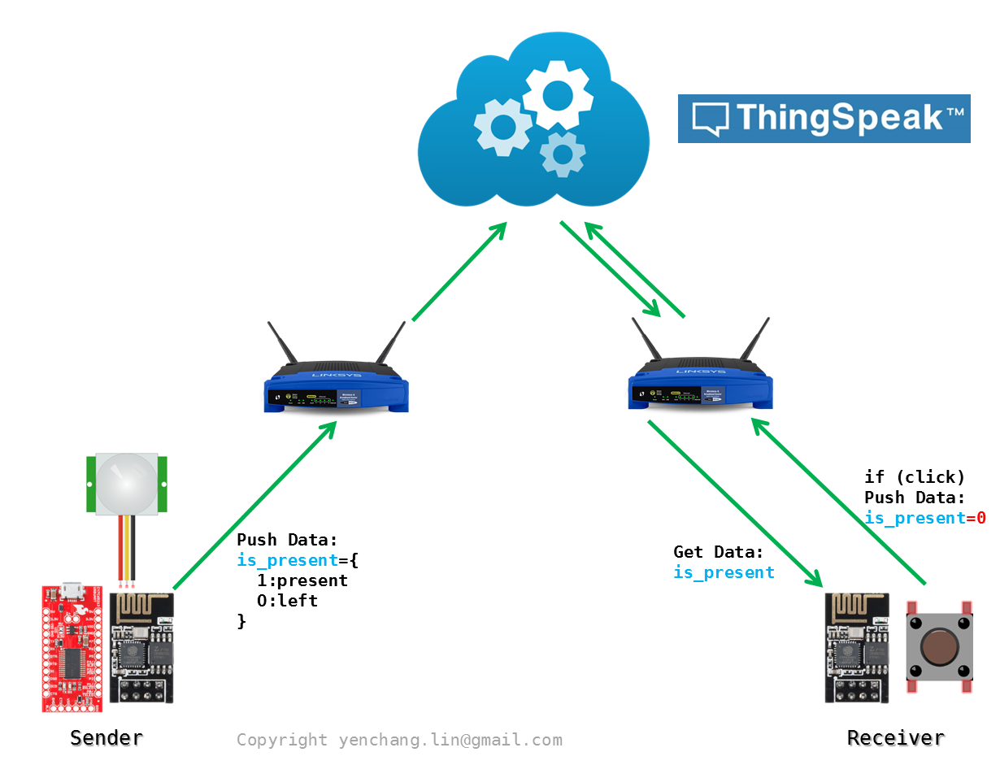
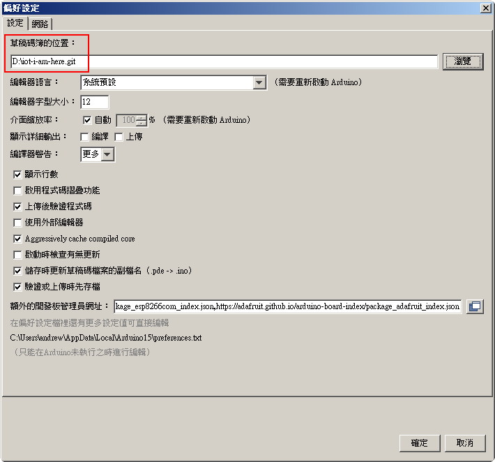
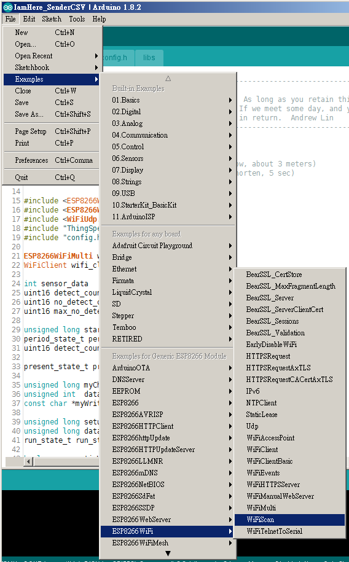
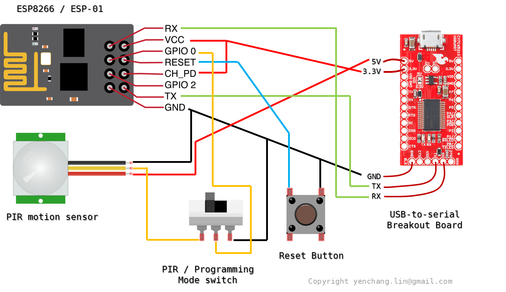
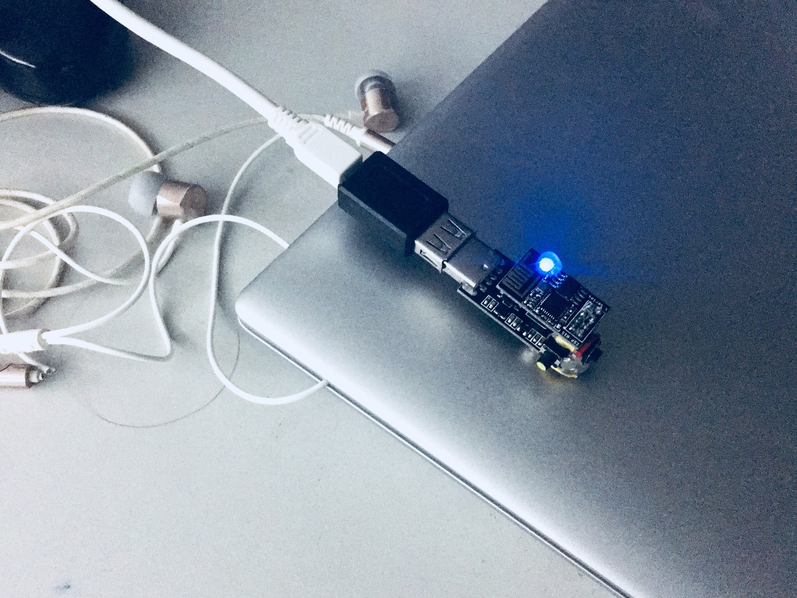
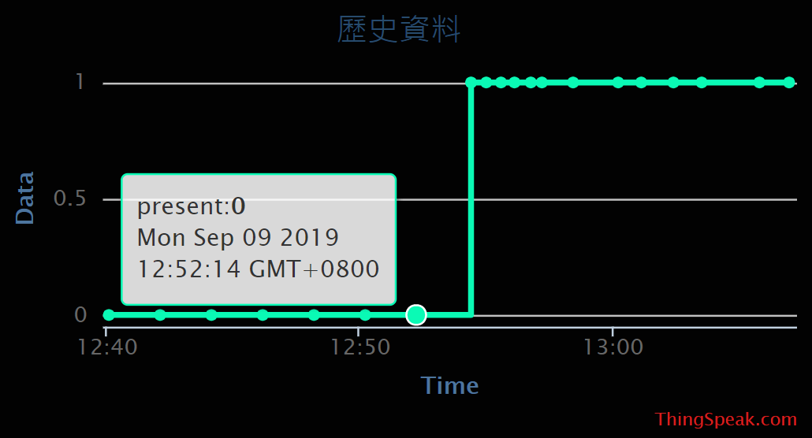
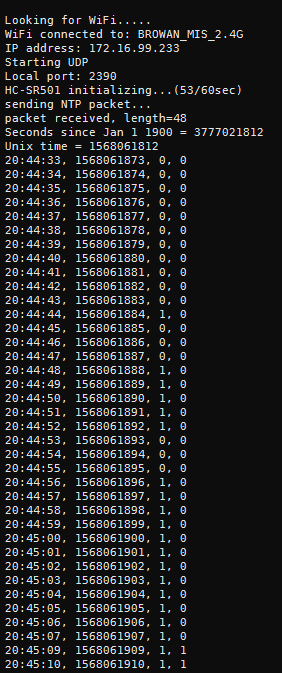

# IoT: I-am-Here

參考 repo: [pir-motion-detector](https://github.com/andrewintw/pir-motion-detector)

## Purpose

讓你的朋友(或家人)知道你是否已經到了公司 XD

## Components Required

* Sender
	* PIR Motion Detector -- HC-SR501
	* WiFi Module -- ESP8266 (ESP-01 model)
	* USB to Serial Breakout Board
* Receiver
	* WiFi Module -- ESP8266 (ESP-01 model)
	* ESP01 UART/Programmer Adapter 
* Free IoT Cloud Service: [ThingSpeak](https://thingspeak.com)

## IoT Topology

簡單的架構如下，分成 Sender 和 Receiver 兩種角色。Sender 根據 PIR 感測的結果傳送否在位子上的資訊上 cloud。

Receiver 定時抓取 Sender push 到 cloud 上的資訊，並以燈號顯示 Sender 是否在位子上。

ps: 你可以在程式碼裡追蹤 is_present 變數，以得知 ESP-01 跟 cloud 通訊的時機點。

## Operation 

運作說明如下:

	1. 在 Sender 座位上放一組 PIR + ESP-01，偵測座位上是否有人，如果有人就更新 cloud 上的數值。
	2. Receiver 座位上放一塊上電的 ESP-01，並含一個按鈕。定時從 cloud 上接收數值並以板載 LED 燈顯示 Sender 座位上是否有人。

為了考量 Sender 若傳送了 "出席" 後就離線，會造成 Receiver 永遠只接收到 "Sender 出席" 的狀態，因此設計了下面的流程:

	1. Receiver 可按下所設計的按鈕，幾秒內會將 cloud 上的數值標記為 "人員離開"。
	2. Sender 假如運作中，則可更新 cloud 上的數值，並在規定時間後更新於 Receiver 裝置。

其它輔助行為:

	* 只要有連上 cloud 的動作，不管是傳送或接收，板載 LED 燈都會快閃一下。
	* 可以設定多組 WiFi SSID/password 資訊，系統會自動選擇能夠連上的 AP。
	* 當網路連線出問題的時候，會嘗試連線其它 AP。  

## About PIR Motion Detection 

事實上關於 PIR 的動作偵測是做這個小專案裡面最關鍵的部分，連網的事情反而是最不重要的事情。

因為 PIR 是 "Motion" sensor，所以當你沒動作的時候，PIR 的輸出是不會有電壓變化的。關於這個問題，我用了一些軟體的方式處理它。詳細的說明和程式碼，請參照另一個 git repo: [pir-motion-detector](https://github.com/andrewintw/pir-motion-detector)

這個專案中 Sender 所用到的 PIR 訊號處理原則，都是由 [MotionDetect_Present](https://github.com/andrewintw/pir-motion-detector/tree/master/MotionDetect_Present) 來的。詳細的說明請參考[說明文件](https://github.com/andrewintw/pir-motion-detector/blob/master/README.zh_TW.md)。

## ThingSpeak setup

我知道 ThingSpeak 非常陽春，但我其實也只是要很陽春的功能，所以剛好夠用就好。

使用這類的 IoT cloud service 的邏輯幾乎都差不多，程序大致上是這樣:

1. 去 cloud service 的頁面註冊帳號 (https://thingspeak.com/)
2. 新增一個 channel。很多 IoT sensor service 都喜歡用這個詞。概念上你可以把 channel 視為一個資料頻道，例如你想偵測你家的溫度，濕度，以及有沒有人在家，這三個資料都可以上傳到 cloud 上成為各別的頻道，當你想看你家的溫度時，就去訂閱那個頻道，就能收到該頻道的資料。
3. 設定 channel 的屬性。其實就是指這個資料是什麼類型? 假如只是開關，你可能預期資料屬性會是 0 或 1。假如是溫度，你可能會預期資料是一個溫度區間。
4. 取得 channel 的 Read/Write API key。這個就是最終會用在程式碼的東西，有點像是通關密語，你的程式在跟 cloud 溝通的時候，會把這些 key 當作通關密語送給 cloud，key 需要正確你的程式碼才能正確地更新或取得資料。

關於 ThingSpeak 的設定其實很簡單，網路上也很多資訊，這裡附上一個簡單的影片：[How to Use ThingSpeak and Arduino to Develop a Temperature Sensor](https://www.youtube.com/watch?v=ssiHSCmTylQ)。

## ESP-01 setup

為了想讓體積小，所以直接使用 ESP-01 當成主要控制 MCU。一些詳細的說明寫在另一個 repo 的[說明文件](https://github.com/andrewintw/pir-motion-detector/blob/master/README.zh_TW.md)中。

## ThingSpeak library for Arduino

你並不需要在你的 Arduino IDE 上下載任何函示庫。或者應該說，你可以這樣做，但假如你想要跟我使用一樣的環境的話，在你將 repo clone 下來後，直接進入 Arduino IDE 的 "Perferences"，在 Sketchbook Location 設定中指定你所 clone 下來的資料夾即可。

## WiFi AP info

你需要準備 WiFi AP 的連線資訊，通常是一組 SSID 和密碼。需注意的是 ESP-01 僅支援 2.4GHz 的 WiFi 環境。並不支援 WiFi 5GHz。如果你不確定那些 AP 可以使用，最簡單的方式就是掃描它吧!

如果你已經正確設定好在 Arduino IDE 上添加對 ESP8266 的支援，你應該可以找到這個範例程式：WiFiScan。將它載入 ESP-01 上執行，console log 所列出的清單就是 ESP-01 可以連上的 AP。

至於如何設定 Arduino IDE 支援 ESP8266，網路上已經有很多教學了，我其實是找了一個最簡單的影片，跟著做就無痛成功了：[Getting Started with ESP 8266 ESP 01 with Arduino IDE | Programming esp-01 with Arduino ide](https://www.youtube.com/watch?v=P8Z-ZHwNeNI)

## Code Adjustment: Sender

假如你看過了上述的[說明文件](https://github.com/andrewintw/pir-motion-detector/blob/master/README.zh_TW.md)，也已經清楚我在 PIR 上的程式運作邏輯，你可以在你的專案中修改下面的參數，以符合你的使用場域。

	/* =================================================================
	 * According to your usage situation adjust the following parameters
	 * =================================================================
	 */
	#define CHK_PERIOD_TIME             (60 * 1000)     /* period 時間的長度，目前是 60 秒 */
	#define THRESHOLD_PRESENT           15              /* period 時間內，被偵測到幾次當作是人在位子 */
	#define THRESHOLD_LEAVE             120             /* 連續沒被偵測 (pv=0) 到幾次當作人已離開 */
	#define CFG_IGNORE_NOISES           1               /* 使否使用雜訊過濾功能 1:on 0:off */
	#define IGNORE_NOISES_NUM           2               /* 連續幾次以下的都當作是雜訊 */
	
	/* ===============================================================
	 * According to your WiFi settings adjust the following parameters
	 * ===============================================================
	 */
	
	wifi_sta_config_t wifi_sta_cfg[] = {
	    {   "MySSID1", "MyPassword1"  },    /* 你可以設定多組 SSID/password */
	    {   "MySSID2", "MyPassword2"  },    /* 系統會嘗試連線可以連線上的 AP */
	    {   "MySSID3", "MyPassword3"  },    /* 請注意指支援 2.4GHz 的 wifi */
	
	    /* DO NOT remove the following line  */
	    {   NULL,   NULL    },
	};
	
	
	/* ============================================================================
	 * According to your Cloud(ThingSpeak) settings adjust the following parameters
	 * ============================================================================
	 */
	#define SECRET_CH_ID                000000          /* ThingSpeak 上的 Channel ID */
	#define SECRET_WRITE_APIKEY         "XYZ"           /* 將 XYZ 取代為你的 Write API Key */
	#define CFG_SEND_WHEN_CHANGE        0
	#define CFG_SEND_IN_EACH_PERIOD     1
	#define SEND_INTERVAL_MS            (15 * 1000)

## IamHere_Sender

目前的線路圖：

## IamHere_Receiver

Receiver 蠻簡單的，只是把 GPIO0 接出去成為按鈕。因為要直接用 ESP-01 板載的 LED 燈，所以不要使用 GPIO2。

## Channel chart

這個部份就沒什麼好說的了，當你把資料 push 到 cloud 之後，通常 cloud service 都會提供一些資料呈現的模組給你使用，在 ThingSpeak 稱之為 Widget。例如下面就是一個可以讓你將 channel 資料顯示在 chart 上的 Widget。

## IamHere_SenderCSV (for Review & Adjustment)

好，現在你有一個系統已經運作了，你想要驗證你在 config.h 裡面所設定的參數是否能夠達到合理的辨識正確率。假如沒有的話，就可以考慮調整你的 config.h 裡，關於 PIR 偵測的參數。

由於 ThingSpeak 所提供的 chart 並不好用，畢竟那只是一個簡單的 Widget。原本我打算試試看將 Sender 的資料傳到 google 試算表裡，你在網路上可以找到相關的教學和程式碼。但後來覺得太麻煩了，畢竟我只是要 "驗證"。真實運作的時候，"儲存歷史資料" 對我來說並不是一個必要的項目。

所以我用了一點迂迴的但偷懶的方式，我改寫了 IamHere_Sender 為 IamHere_SenderCSV，讓它的輸出格式是 csv 的格式。

第一欄的時間是目前的時間，為了讓 review 時回想自己當時正在幹嘛，這支程式一開頭有做 NTP 校時，但沒有處理傳送接收端的 delay 補償，所以應該會差個幾秒鐘。

第二欄是 UnixTime，數列的方式方便你製作 chart 的時候當作 X 軸。第三欄是 PIR out 的即時資料。最後一欄是系統目前判斷此人在不在位子上。

然後，我可以使用一些能記錄 console log 的 Terminal 軟體，例如: putty、Tera Term...等等。將整天的 log 記錄起來，然後把 data 的部分存檔成 .csv 檔，再用 Excel 存成 .xlsx 或 .xls 格式，就可以繪製圖表檢視了。

## LICENSE

	/*
	 * --------------------------------------------------------------------------------
	 * "THE BEER-WARE LICENSE" (Revision 42):
	 * <yenchang.lin@gmail.com>  wrote this program.  As long as you retain this notice
	 * you can do whatever you want with this stuff. If we meet some day, and you think
	 * this stuff is worth it, you can buy me a beer in return.  Andrew Lin
	 * --------------------------------------------------------------------------------
	 */
	
	/*
	 * ---------------------------------------------------------------------
	 * "啤酒授權條款"（修訂版 R42）：
	 * <yenchang.lin@gmail.com> 寫了這個程式。只要你保留這個授權條款在你的文檔中，
	 * 你就可以用這些文檔做任何你想做的事。如果我們有一天我們有緣見到面，
	 * 而你覺得我寫的這個東西對你有幫助，你可以請我喝一杯啤酒作為回報。   Andrew Lin
	 * ---------------------------------------------------------------------
	 */